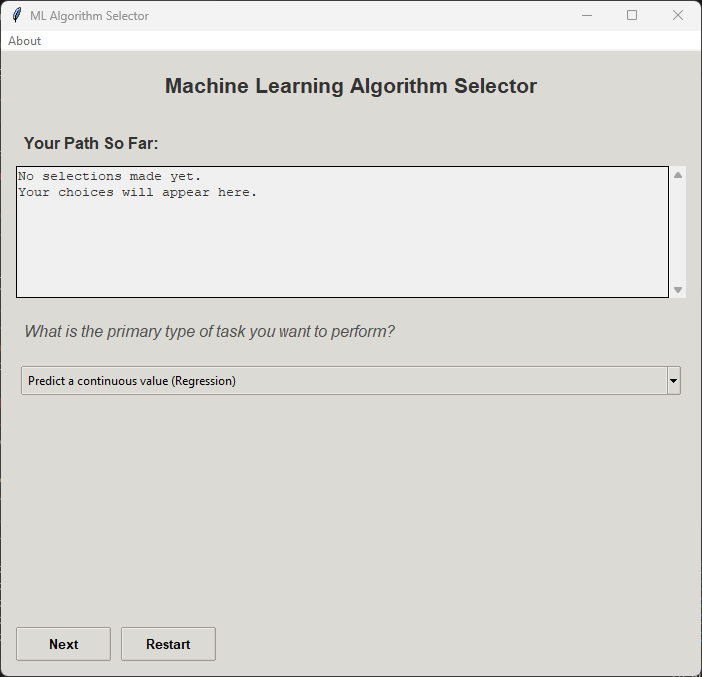
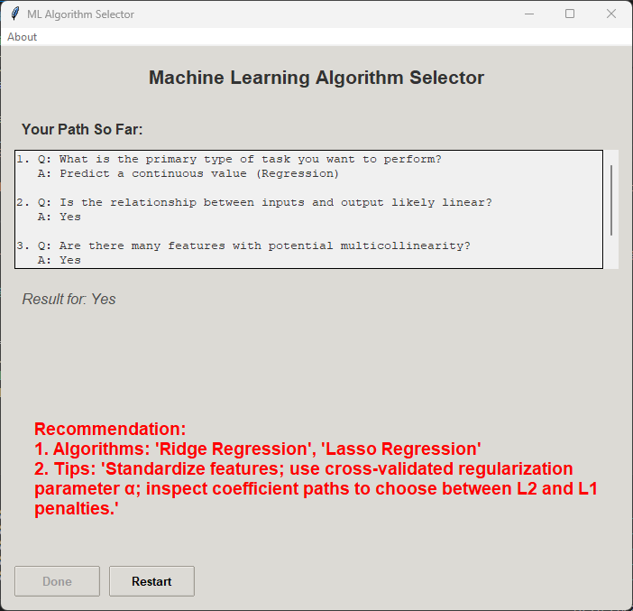

# ML Algorithm Selector GUI

A Python Tkinter application designed to help users select appropriate Machine Learning algorithms based on a series of guided questions. It also provides practical tips for the recommended algorithms.

## Table of Contents

1.  [Overview](#overview)
2.  [Screenshots](#screenshots)
3.  [Features](#features)
4.  [How It Works](#how-it-works)
5.  [Getting Started](#getting-started)
    *   [Prerequisites](#prerequisites)
    *   [Installation](#installation)
    *   [Running the Application](#running-the-application)
6.  [Dependencies](#dependencies)
7. [Contributing](#contributing)
8. [License](#license)

## Overview

The ML Algorithm Selector is an interactive desktop application built with Python and Tkinter. It guides users through a decision-making process to identify suitable machine learning algorithms for their specific tasks: *regression, classification, time series forecasting, clustering, dimensionality reduction, new data generation and special classification scenarios*. By answering a series of questions, users narrow down the options, ultimately receiving recommendations along with practical implementation tips. This tool is particularly useful for a quick way to explore algorithm choices.

This tool was inspired by the article [Choosing the Right Machine Learning Algorithm: A Decision Tree Approach](https://www.kdnuggets.com/choosing-the-right-machine-learning-algorithm-a-decision-tree-approach), by Iván Palomares Carrascosa (Kdnuggets May 21, 2025).

The development of this Python GUI was done with the assitance of OpenAI's o4-mini-high model.

## Screenshots

Here are a couple of screenshots of the application:

1.  **Main GUI (Initial State):** The application interface upon startup, showing the first question.



2.  **GUI Showing a Recommendation:** An example of the GUI after navigating through a few questions and receiving an algorithm recommendation with tips.



## Features

*   **Interactive GUI:** User-friendly interface built with Tkinter and ttk for a modern look.
*   **Decision Tree Navigation:** Guides users through a structured set of questions.
*   **Algorithm Recommendations:** Suggests ML algorithms based on user choices.
*   **Practical Tips:** Provides useful tips and considerations for each recommended algorithm.
*   **History Tracking:** Displays the user's path (questions and answers) through the decision tree.
*   **Restart Functionality:** Allows users to easily start the selection process over.
*   **"About" Section:** Provides information about the application and its author.

## How It Works

The application operates based on a predefined decision tree, which is hardcoded as a Python dictionary.
1.  The user is presented with an initial question.
2.  Based on the type of question, the user selects an answer using either radio buttons (for Yes/No questions) or a combobox (for multiple-choice questions).
3.  Upon clicking "Next", the application processes the answer:
    *   The chosen question and answer are added to the "Your Path So Far" history panel.
    *   The application navigates to the next node in the decision tree corresponding to the user's answer.
4.  A new question is displayed, or if a leaf node is reached, the recommended algorithm(s) and associated tips are shown.
5.  The "Next" button becomes "Done" when a final recommendation is displayed.
6.  The user can click "Restart" at any point to clear their history and return to the first question.

## Getting Started

Follow these instructions to get a copy of the project up and running on your local machine.

### Prerequisites

*   **Python 3.x:** The application is written in Python 3. Make sure you have Python 3 installed. You can download it from [python.org](https://www.python.org/downloads/).
*   **Tkinter:** Tkinter is part of the Python standard library and should be available with most Python installations. If you are on a Linux system and it's missing, you might need to install it separately (e.g., `sudo apt-get install python3-tk` on Debian/Ubuntu).

### Installation

**Clone the repository (or download the script):**
    ```bash
    git clone https://github.com/cagelmi/ml-decision-tree.git
    cd ml-decision-tree
    ```
Or simply download the Python script file `ml_selector_gui.py`.

### Running the Application

Navigate to the directory where you saved the Python script (e.g., `ml_selector_gui.py`) and run it from your terminal:

```bash
python ml_selector_gui.py
```

## Contributing

Contributions, bug reports, and feature requests are welcome! Please feel free to open an issue or submit a pull request.
When contributing to this repository, please first discuss the change you wish to make via issue or email with the maintainers before making a change.

## License

This project is licensed under the **MIT License**.
